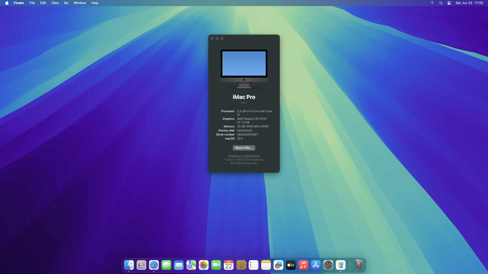

# hackintosh-z690-i512400f-rx6700xt

MacOS Sequoia EFI for OpenCore based on z690 motherboard, i5 12400f CPU and 6700 XT GPU.

---

### Information 

- MacOS: [Sequoia BETA](https://www.apple.com/macos/macos-sequoia-preview/)
- Bootloader: OpenCore 1.0.0 (Patched Kext)
- Download Sonoma first then update to Sequoia through Beta Updates. Change the SMBIOS serial number for privacy/security reasons.
- If you have coilwhine or otherwise want to change the performance of the GPU then edit Kext > NootRX > Contents > Info.plist and search for "PP_WorkLoadPolicyMask"
- Different PP_WorkLoadPolicyMask settings: 1 (Default, no coil whine, around 80k performance), 20 (Some coil whine, 160k performance), 40 (No coil whine but fans may spin up a bit, around 100k performance) 

### Functionality
| Component    | Status |
|:---------:|:---:|
| Wifi      | 🚫 |
| Bluetooth | 🚫 |
| Ethernet  | ✅ |
| dGPU      | ✅ |
| NVME      | ✅ |
| DRM       | 🚫 |
| Wakeup/Restart/Power Off| 🚫 (Lilu bug on Sequoia) |

### Hardware

| Component    | Variant                   | Link                                                                                                                                         |
|:------------:|:-------------------------:|:--------------------------------------------------------------------------------------------------------------------------------------------:|
| Mainboard    | MSI Z690-A Pro Wifi DDR4  | [MSI](https://www.msi.com/Motherboard/PRO-Z690-A-WIFI-DDR4)                                                                                  |
| Processor    | Intel Core i5 12400F      | [Intel i5 12400F](https://ark.intel.com/content/www/us/en/ark/products/134587/intel-core-i512400f-processor-18m-cache-up-to-4-40-ghz.html)   |
| Audio        | ALC897 / ALC892           |                                                                                                                                              |
| DDR4 RAM     | HyperX Fury Beast 32GB    | [Kingston](https://www.kingston.com/datasheets/KF436C16RB1A_16.pdf)                                                                          |
| NVMe SSD     | WD_Black SN770 NVME       | [WD_Black](https://www.westerndigital.com/products/internal-drives/wd-black-sn770-nvme-ssd?sku=WDS250G3X0E)                                  |
| Graphics     | AMD Radeon RX 6700XT      | [AMD Radeon RX 6700XT](https://www.amd.com/en/products/graphics/amd-radeon-rx-6700-xt)                                                       |
| WiFi / BT    | Intel® Wi-Fi 6E           | [Intel Wi-Fi 6E](https://www.intel.com/content/www/us/en/products/sku/130293/intel-wifi-6-ax201-gig/specifications.html)                     |
| Lan / Ethernet| Intel® I225-V            |                                                                                                                                              |
